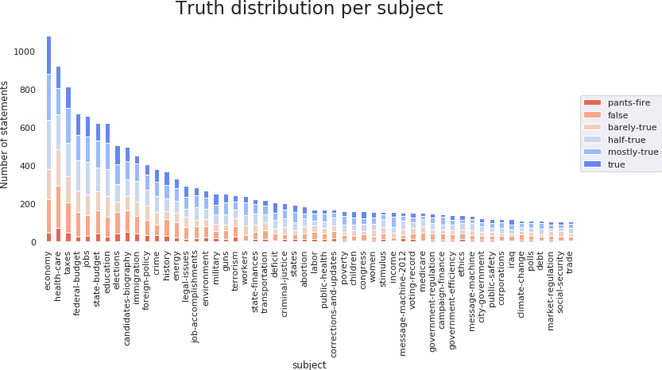
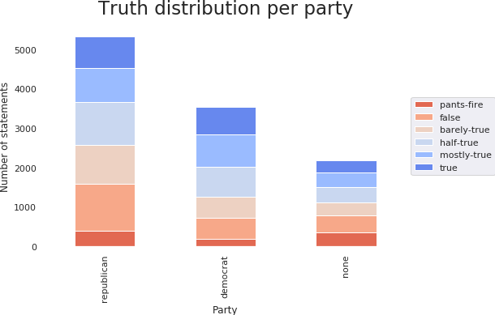

---
# You don't need to edit this file, it's empty on purpose.
# Edit theme's home layout instead if you wanna make some changes
# See: https://jekyllrb.com/docs/themes/#overriding-theme-defaults
layout: default
---

The advent of internet and the tremendous interconnectivity it created between
people comes with the downside of less checks for the validity of the
information. Nowdays everyone can have a website and share information, without
restrictions on the content quality.

Understanding the lying patterns in order to be able to detect lies is a
difficult task. More research in natural language processing is needed, as well
as more psychological studies and data. In this project, we take a small step
in this direction, performing analysis of labelled political statements.

Politics is a widely debated topic with direct impact on people's
lives. Most modern states in Europe and North America are based on
representative democracy, where vital decisions regarding the future of the
country are taken by representatives chosen thorugh vote. Trusting those people
is therefore a vital, but not an easy task. There is a strong incentive of
deforming the truth or lying in the election campain to gain more votes, or
during their mandate in order to keep a position of power.

Another related problem of modern society are the fake news. Media
companies strive to create high impact news, not always reporting the truth.

In this project, we perform an analysis of the Liar dataset, a dataset of
political statements from [PolitiFact](http://www.politifact.com), looking
at cues for determining the truthfulness of a statement. We also experiment
with some machine learning models to get more insight into the data and
extrapolate this insight into new statements.

## The Liar dataset

A great challenge for deception detection is the lack of a large amount of
labelled data. We have used for our analysis the
[Liar dataset (Wang, 2017)](https://arxiv.org/abs/1705.00648).
This is, to the best of our knowledge, one of the biggest datasets
of statements labelled according to their truthfulness.

Unfortunately, while the dataset provides a lot of information regarding the
context of the statement, which receives a certain classification from 6 
classes of truth, it has only about 12000 entries. The relatively low number 
of entries, as well as the predominance of statements from the US politics, 
does not allow for a good generalization. However, there is enough data for 
an analysis of the US political statements from the past decade.

#### The political language

Since we are dealing with natural language, we decided to start our analysis
by examining the vocabulary present in the dataset. In general, a similar 
word distribution over the statements is expected, given that all the 
statements are political and made in English. However, our focus is finding 
words that tend to have a higher precedence in a particular truth class.

This is a relatively small dataset, with a body of almost 190 000 words.
However, with almost 12 000 unique tokens (we count 'home' and 'homes'
as 2 different tokens), it has a variate vocabulary, many words appearing just
once or twice. For comparison, a publication by Laufer et al, 2010, indicates
that understanding 8000 word families leads to a 98% vocabulary coverage in an
average English spoken discourse, with as little as 3000 word families (5000
lexical items) necessary for a minimal reading comprehension (Laufer (1992),
Adolphs (2003)). Note that these publications talk about word families and
lexical items, while we count tokens.

{: .center-image }

Looking at the most common words in the dataset, we can observe the main topics
of discussion in politics at the time, such as health care or Barack
Obama, as well as some features of the political speech, such as the prevalence
of percentages or years. Also, topics of interest for politics such as bill,
vote or government are present amongst the most used words in this dataset.

Although the dataset has 6 levels of truth, we analyze the language
used in true and false statements in general, looking for differences in words
usage.

{: .center-image }
{: .center-image }

We can make a few remarks on the words usage. The word 'million' is more used
in true statements, while the word 'billion' is more used in false statements.
This can suggest a tendency of exaggeration. Also, 'percent' and 'year' tend
to be less used in false statements, possibly indicating a tendency in the lack
of precision. 'Health care', 'obamacare' and 'Barack Obama' are also more 
present in untruthful statements. This is an interesting fact - since a large 
part of the dataset overlaps with the Barack Obama's presidency, health care
being a controversial topic at the time.

#### Subjects people talk about

The dataset has over 12000 statements discussing 145 unique subjects, such as
economy, climate change or immigration. We focused our analysis on the 54
subjects, each with more than 100 statements:

{: .center-image }

The economy and the health care are the most commonly used subjects in the
dataset. As noticed from the language analysis, health care and Medicare are
the subjects with the largest proportion of lies, while income and poverty
rates appear more often in true statements:

{: .center-image }

#### Who is speaking

We perform a similar analysis on the speakers. The statements in the dataset
have been made by 3310 unique speakers, such as Donald Trump or Ron Jonson, or
sources such as Blog or Facebook Posts. We look at the 29 speakers
with more than 50 statements.

{: .center-image }

{: .center-image }

We notice that Barack Obama, Donald Trump and Hillary Clinton have the most
statements. The normalized truth distribution visualization is a good
indication of the trustworthiness of a politician. Barack Obama and Hilary
Clinton are amongst the most reliable, with relatively few deceptive statements
compared to unreliable sources, such as Blog Posts, or other politicians,
such as Donald Trump.

Another remark is that, according to the available data, Facebook posts are
more reliable in general and blog posts. Chain emails are the worst source of
information, with the highest number of lies. This is an interesting premise to
follow in trying to determine the best source for information, but more data
would be needed for a definite answer.

Since this analysis is performed over a small dataset, its
generalizatio is based on the assumption of uniform sampling
of the dataset. However, at such low statement counts, it is very possible that
the sampling introduced some bias.

#### What are speaker's professions

Another relevant feature for the trustworthiness of an individual might be
their profession. In the Liar dataset, 803 professions are represented, with 18
of them with over 50 samples.

{: .center-image }

{: .center-image }

The most frequently encountered jobs are political positions, the most common 
being senator and house member. This is expected, considering that the 
statements are political. Looking at the normalized distribution, the president
is the most reliable source, with under 30% of the statements being classified
as lies.

Unsurprisingly, the social media is remarkably unreliable, with a high number
of outrageous lies. All the statements of a President Elect belong to Donald
Trump, while 611 out of the 615 presidential statements belong to Barack Obama.
This correlates with the speaker trustworthiness analysed above, with Barack
Obama being one of the most trustworthy people.

#### Political affiliation

Over 84% of the speakers in our dataset have 3 political affiliations, being
democrats, republicans or with no political affiliations. 

{: .center-image }

{: .center-image }

In general, there is a tendency of the democrats to be more sincere than the
republicans. Barack Obama made only 15% of the democrat statements and Donald 
Trump only 6% of the republican ones. We have found that removing these 2 
people does not change the general trend, republicans still having about 10% 
more untruthful statements than democrats.

This is possibly due to the political context in which the data has been
sampled - the republican opposition might have had an incentive to bend the
truth to consolidate its position. We again note that this is a conclusion
reached based on a small dataset and intution regarding the political context,
being by no means a definitive statement.

The people with no political affilition have a relatively high number of
untrue statements. This is likely due to the unreliable sources included in
this category, such as blog posts.

#### Social media vs. public figures on hot topics

We do a short comparision of the trustworthiness between social media sources,
such as Facebook posts, chain email, and statements from public figures,
looking at two widely debated topics in politics, health care and income.

{: .center-image }

{: .center-image }

On both topics, the social media is much more unreliable than public figures.
We can motivate this by the lack of any filter of the social media, anyone
being able to post their opinion. Public figures on the other hand, have earned
the trust of a group (such as a political party) and might have more to lose by
lying.

#### Do people use numbers in lies?

There is an old proverb saying that *numbers don't lie*. The presence of
numbers in a statements might indicate its trustworthiness, due to various
biases that occur when people lie.

{: .center-image }

The statements that contain numbers tend to have a higher truth ratio, most
likely due to the precise nature of numbers. However, this is not definitory:
there is still about a third of statements that contain numbers and are
untruthful.

#### Sentimental analysis

When analysing features of the natural language, especially when considering
a context such as politics which people can get passionate about, the
sentimental analysis might be insightful.

Unfortunately, the quantitative analisys does not suggest any strong bias in
any of the classes:

{: .smaller }

{: .smaller }

#### Most important features in discriminating lies

Now we can answer the most important question: what is the most important
feature of a statement that can be used to determine its truthfulness.

Using machine learning approaches for a definitive classification is very
difficult, especially when considering the complexity of the problem and the
limited size of the dataset. The original publication
[Liar dataset (Wang, 2017)](https://arxiv.org/abs/1705.00648) manages to
achieve only about 30% accuracy in classification.

We have trained multiple classifiers on the dataset, in an attempt not to gain
high accuracy, but to get more insight into which features are more informative
in classification.

A naive Bayes classifier trained on the statements themselves shows the words
that occur the most in various classes. To ease the interpretation of this
analysis, we have split the dataset in only two classes, true and false
statements. In this case, *takeover* is the most informative word, being
11.5 more likely to be in false statements. *scheme*, *Cuccinelli*, *socialist*,
*showed*, *illegals*, *McAauliffe* and are also words that appear 7 to 9 times
more likely to be in false statements.

We have augmented the dataset with the output from a naive Bayes statement
classifier, sentiment analysis, presence of numbers and trained a random
forest. Looking at the most informative features, the most relevant is the
output of the naive Bayes classifier (which encodes the statement), followed
by the metrics for sentiment analysis.

The remaining features are: subject - taxes, subject - health care, party
- republican, party - democrat, context - a speech, state - Florida, context
  - a television ad, subject - immigration.

As expected from the previous analysis, there are hot topics such as taxes and
health care that, by their controversial nature and political context, are more
likely to be lied about or more likely to be discussed truthfully. Also, the
political affiliation plays an important role, as discussed above.

