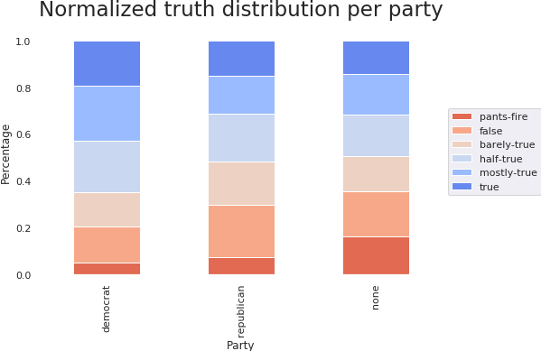

---
# You don't need to edit this file, it's empty on purpose.
# Edit theme's home layout instead if you wanna make some changes
# See: https://jekyllrb.com/docs/themes/#overriding-theme-defaults
layout: default
---

The advent of internet and the tremendous interconnectivity it created between
people comes with the downside of less checks for the validity of the
information. Nowdays everyone can have a website and share information, without
restrictions on the content quality.

Understanding the lying patterns in order to be able to detect lies is a
difficult task. More research in natural language processing is needed, as well
as more psychological studies and data. In this project, we take a small step
in this direction, performing analysis of labelled political statements.

Politics is a widely debated topic with direct impact on people's
lives. Most modern states in Europe and North America are based on
representative democracy, where vital decisions regarding the future of the
country are taken by representatives chosen thorugh vote. Trusting those people
is therefore a vital, but not an easy task. There is a strong incentive of
deforming the truth or lying in the election campain to gain more votes, or
during their mandate in order to keep a position of power.

Another related problem of modern society are the fake news. Media
companies strive to create high impact news, not always reporting the truth.

In this project, we perform an analysis of the Liar dataset, a dataset of
political statements from [politifact](http://www.politifact.com), looking
at cues for determining the truthfulness of a statement. We also experiment
with some machine learning models to get more insight into the data and
extrapolate this insight into new statements.

## The Liar dataset

A great challenge for deception detection is the lack of a large amount of
labelled data. We have used for our analysis the
[Liar dataset (Wang, 2017)](https://arxiv.org/abs/1705.00648).
This is, to the best of our knowledge, one of the biggest datasets
of statements labelled according to their truthfulness.

Unfortunately, while the dataset provides a lot of information regarding the
context of the statement, which receives a certain classification from 6 
classes of truth, it has only about 12000 entries. The relatively low number 
of entries, as well as the predominance of statements from the US politics, 
does not allow for a good generalization. However, there is enough data for 
an analysis of the US political statements from the past decade.

#### The political language

Since we are dealing with natural language, we decided to start our analysis
by examining the vocabulary present in the dataset. In general, a similar 
word distribution over the statements is expected, given that all the 
statements are political and made in English. However, our focus is finding 
words that tend to have a higher precedence in a particular truth class.

This is a relatively small dataset, with a body of almost 190 000 words.
However, with almost 12 000 unique tokens (we count 'home' and 'homes'
as 2 different tokens), it has a variate vocabulary, many words appearing just
once or twice. For comparison, a publication by Laufer et al, 2010, indicates
that understanding 8000 word families leads to a 98% vocabulary coverage in an
average English spoken discourse, with as little as 3000 word families (5000
lexical items) necessary for a minimal reading comprehension (Laufer (1992),
Adolphs (2003)). Note that these publications talk about word families and
lexical items, while we count tokens.

{: .center-image }

Looking at the most common words in the dataset, we can observe the main topics
of discussion in the politics at the time, such as health care or Barack
Obama, as well as some features of the political speech, such as the prevalence
of percents or years. Also, topics of interests for politics such as bill,
vote or government are present amongst the most used words in this dataset.

Although the dataset has 6 levels of truth, we take a look at the language
used in true and false statements in general, looking for differences in word
usage.

{: .center-image }
{: .center-image }

We can make a few remarks on the words usage. The word 'million' is more used
in true statements, while the word 'billion' is more used in false statements.
This can suggest a tendency of exaggeration. Also, 'percent' tends to be less
used in false statements, possibly indicating a tendency in the lack of
precision. 'Health care', 'obamacare' and 'Barack Obama' are also more present
in untruthful statements. This is an interesting fact - since a large part of
the dataset overlaps with the Barack Obama's presidency, health care being
a controversial topic at the time.

#### Subjects people talk about

The dataset has over 12000 statements discussing 145 unique subjects, such as
economy, climate change or immigration. We focused our analysis on the 54
subjects with more than 100 statements:

{: .center-image }

The economy and the health-care are the most represented subjects in the
dataset. As noticed from the language analysis, health-care and medicare are
the subjects with the largest proportion of lies:

{: .center-image }

#### Who is speaking

We perform a similar analysis on the speakers. The statements in the dataset
have been made by 3310 unique speakers, such as Donald Trump or Ron Jonson, or
sources such as Planned Parenthood or Blog Posts. We look at the 29 speakers
with more than 50 statements.

{: .center-image }

{: .center-image }

We notice that Barack Obama, Donald Trump and Hillary Clinton have the most
statements. The normalized truth distribution visualization is a good
indication of the trustworthiness of a politician. Barack Obama and Hilary
Clinton are amongst the most reliable, with relatively few deceptive statements
compared to unreliable sources, such as blog postings, or other politicians,
such as Donald Trump.

We note that this analysis is performed over a small dataset. The
generalization of this analysis is based on the assumption of uniform sampling
of the dataset. However, at such low statement counts, it is very possible that
the sampling introduced some bias.

#### What are speaker's professions

Another relevant feature for the trustworthiness of an individual might be
their profession. In the Liar dataset, 803 professions are represented, with 18
of them with over 50 samples.

{: .center-image }

{: .center-image }

The most common jobs are political positions, the most common being senator and
house member. This is expected, considering that the statements are political.

#### Political affiliation

Over 84% of the speakers in our dataset have 3 political affiliations, being
democrats, republicans or with no political affiliations. 

{: .center-image }

{: .center-image }

